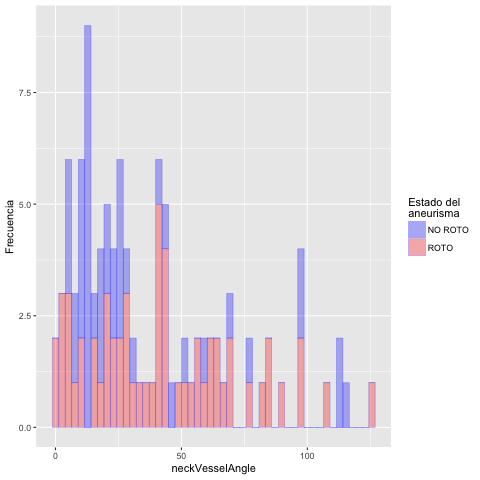
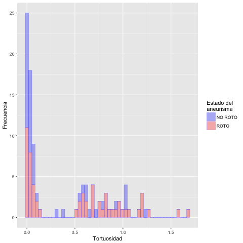
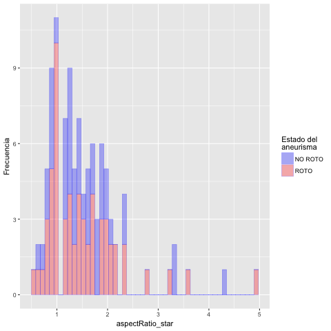
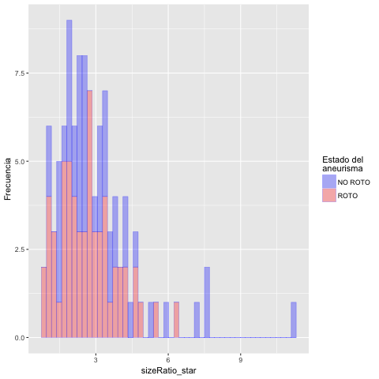
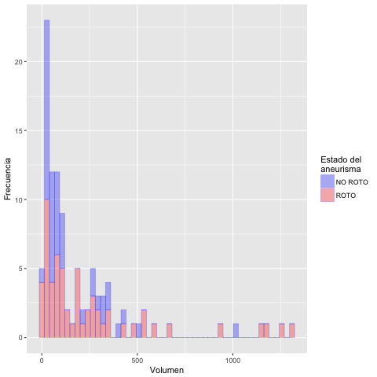
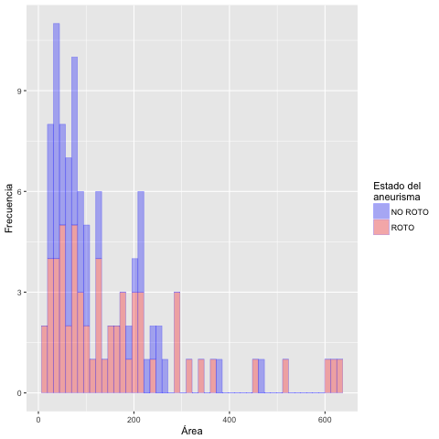
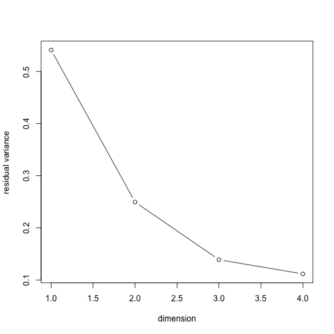
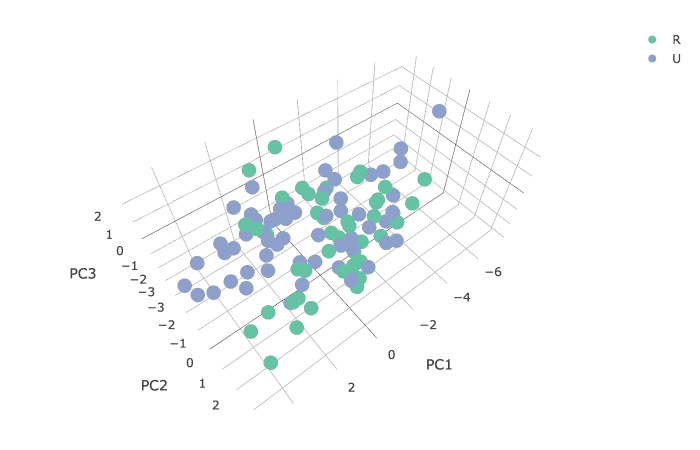

<h2>Table of Contents</h2>

<ul>
<li><a href="#org182cc90">1. Intro</a></li>
<li><a href="#orgcc0aa9f">2. Descriptive Analysis</a>
<ul>
<li><a href="#orgd47d1cc">2.1. Individual viariable statistical analysis</a>
<ul>
<li><a href="#org603a49b">2.1.1. $ ESTADO_RUPTURA         : chr  "U" "U" "U" "U" &#x2026;</a></li>
<li><a href="#orgd6ab802">2.1.2. $ LOCALIZACION_ANEURISMA : chr  "ICA" "ICA" "ICA" "ICA" &#x2026;</a></li>
<li><a href="#orgabbaf0c">2.1.3. $ SEXO                   : chr  "F" "F" "F" "F" &#x2026;</a></li>
<li><a href="#org0c8afa0">2.1.4. $ TIPO_ANEURISMA         : chr  "LAT" "LAT" "TER" "TER" &#x2026;</a></li>
<li><a href="#orga682fc6">2.1.5. $ EDAD                   : int  53 35 43 60 26 45 44 68 39 63 &#x2026;</a></li>
<li><a href="#org2ef0b6b">2.1.6. $ MORPHO_SHAPE           : int  1 1 0 0 0 2 2 1 2 1 &#x2026;</a></li>
<li><a href="#orgc22ba19">2.1.7. $ MULTIPLE_ANEURISMA     : logi  FALSE FALSE FALSE TRUE FALSE FALSE &#x2026;</a></li>
<li><a href="#orgdc587b5">2.1.8. $ neckVesselAngle        : num  42.6 84.1 44 39.8 60 &#x2026;</a></li>
<li><a href="#org94c5fa4">2.1.9. $ sacVesselAngle         : num  33.82 94.53 52.29 4.98 56.48 &#x2026;</a></li>
<li><a href="#org5fc1ccc">2.1.10. $ bifurcationAngleInPlane: num  76.7 116.8 123.7 129.8 117.1 &#x2026;</a></li>
<li><a href="#orgd4b83a8">2.1.11. $ aspectRatio_star       : num  1.499 1.839 0.948 0.706 1.827 &#x2026;</a></li>
<li><a href="#org3f95fce">2.1.12. $ sacVolume              : num  125.26 119 12.74 9.38 37.93 &#x2026;</a></li>
<li><a href="#orgce76f61">2.1.13. $ sacSurfaceArea         : num  120.5 122.4 23.5 18.1 54.8 &#x2026;</a></li>
<li><a href="#org5c7f4c6">2.1.14. $ vdcVolume              : num  111.24 113.72 11.87 9.03 35.9 &#x2026;</a></li>
<li><a href="#org2665002">2.1.15. $ vdcSurfaceArea         : num  106.8 115.8 21.9 17.3 52.3 &#x2026;</a></li>
<li><a href="#org682f2f5">2.1.16. $ sacSectionArea         : num  21.94 18.49 6.14 4.91 9.73 &#x2026;</a></li>
</ul>
</li>
<li><a href="#org4ffbd67">2.2. Histograms of sacVolume and sacSurfaceArea</a></li>
</ul>
</li>
<li><a href="#org52ef641">3. Variable selection</a></li>
<li><a href="#org27ef1bb">4. Data preprocessing</a></li>
<li><a href="#orgcb788f5">5. Non-linear manifold learning</a>
<ul>
<li><a href="#org9fb113e">5.1. Locally Linear Embedding - LLE</a></li>
<li><a href="#org1c952c6">5.2. IsoMap</a></li>
</ul>
</li>
<li><a href="#orgc312392">6. Regression Models</a>
<ul>
<li><a href="#orgd4a22f8">6.1. Logistic regression of rupture/unruptered variable</a></li>
</ul>
</li>
</ul>

We analyze the aneurisk data set containing decriptive variables of patients showing ruptured and
unruptured aneurisms.

# Intro

In the next section we make an exploratory descriptive statistical analysis, to probe the main
characteristics in the data. In the following section we try out some preliminary models to explore
correlations that may prove useful for future, more realistic models.

# Descriptive Analysis

## Individual viariable statistical analysis

Contingency tables for categorical variables and main statistical descriptors for continuous variables.

### $ ESTADO\_RUPTURA         : chr  "U" "U" "U" "U" &#x2026;

<table border="2" cellspacing="0" cellpadding="6" rules="groups" frame="hsides">

<colgroup>
<col  class="org-left" />

<col  class="org-right" />
</colgroup>
<tbody>
<tr>
<td class="org-left">R</td>
<td class="org-right">44</td>
</tr>

<tr>
<td class="org-left">U</td>
<td class="org-right">59</td>
</tr>
</tbody>
</table>

### $ LOCALIZACION\_ANEURISMA : chr  "ICA" "ICA" "ICA" "ICA" &#x2026;

<table border="2" cellspacing="0" cellpadding="6" rules="groups" frame="hsides">

<colgroup>
<col  class="org-left" />

<col  class="org-right" />
</colgroup>
<tbody>
<tr>
<td class="org-left">ACA</td>
<td class="org-right">24</td>
</tr>

<tr>
<td class="org-left">BAS</td>
<td class="org-right">7</td>
</tr>

<tr>
<td class="org-left">ICA</td>
<td class="org-right">46</td>
</tr>

<tr>
<td class="org-left">MCA</td>
<td class="org-right">26</td>
</tr>
</tbody>
</table>

### $ SEXO                   : chr  "F" "F" "F" "F" &#x2026;

<table border="2" cellspacing="0" cellpadding="6" rules="groups" frame="hsides">

<colgroup>
<col  class="org-left" />

<col  class="org-right" />
</colgroup>
<tbody>
<tr>
<td class="org-left">F</td>
<td class="org-right">65</td>
</tr>

<tr>
<td class="org-left">M</td>
<td class="org-right">38</td>
</tr>
</tbody>
</table>

### $ TIPO\_ANEURISMA         : chr  "LAT" "LAT" "TER" "TER" &#x2026;

<table border="2" cellspacing="0" cellpadding="6" rules="groups" frame="hsides">

<colgroup>
<col  class="org-left" />

<col  class="org-right" />
</colgroup>
<tbody>
<tr>
<td class="org-left">LAT</td>
<td class="org-right">40</td>
</tr>

<tr>
<td class="org-left">TER</td>
<td class="org-right">63</td>
</tr>
</tbody>
</table>

### $ EDAD                   : int  53 35 43 60 26 45 44 68 39 63 &#x2026;

We compute minimum, median and maximum age, along with quantiles 25 and 75. 

<table border="2" cellspacing="0" cellpadding="6" rules="groups" frame="hsides">

<colgroup>
<col  class="org-left" />

<col  class="org-right" />
</colgroup>
<tbody>
<tr>
<td class="org-left">min</td>
<td class="org-right">24</td>
</tr>

<tr>
<td class="org-left">q25</td>
<td class="org-right">43</td>
</tr>

<tr>
<td class="org-left">med</td>
<td class="org-right">55</td>
</tr>

<tr>
<td class="org-left">q75</td>
<td class="org-right">64.5</td>
</tr>

<tr>
<td class="org-left">max</td>
<td class="org-right">85</td>
</tr>
</tbody>
</table>

### $ MORPHO\_SHAPE           : int  1 1 0 0 0 2 2 1 2 1 &#x2026;

<table border="2" cellspacing="0" cellpadding="6" rules="groups" frame="hsides">

<colgroup>
<col  class="org-right" />

<col  class="org-right" />
</colgroup>
<tbody>
<tr>
<td class="org-right">0</td>
<td class="org-right">31</td>
</tr>

<tr>
<td class="org-right">1</td>
<td class="org-right">29</td>
</tr>

<tr>
<td class="org-right">2</td>
<td class="org-right">43</td>
</tr>
</tbody>
</table>

### $ MULTIPLE\_ANEURISMA     : logi  FALSE FALSE FALSE TRUE FALSE FALSE &#x2026;

<table border="2" cellspacing="0" cellpadding="6" rules="groups" frame="hsides">

<colgroup>
<col  class="org-left" />

<col  class="org-right" />
</colgroup>
<tbody>
<tr>
<td class="org-left">FALSE</td>
<td class="org-right">86</td>
</tr>

<tr>
<td class="org-left">TRUE</td>
<td class="org-right">17</td>
</tr>
</tbody>
</table>

### $ neckVesselAngle        : num  42.6 84.1 44 39.8 60 &#x2026;

      Min.  1st Qu.   Median     Mean  3rd Qu.     Max. 
    0.9618  13.5239  27.6917  38.1383  56.8219 126.6495

### $ sacVesselAngle         : num  33.82 94.53 52.29 4.98 56.48 &#x2026;

sacVesselAngle presents a skewed distribution.

      Min.  1st Qu.   Median     Mean  3rd Qu.     Max. 
    0.5619  16.6913  32.8631  40.2026  57.0421 146.9719

### $ bifurcationAngleInPlane: num  76.7 116.8 123.7 129.8 117.1 &#x2026;

     Min. 1st Qu.  Median    Mean 3rd Qu.    Max. 
    61.65  107.20  118.96  124.94  143.84  209.67

Very slightly skewed distribution

-   $ tortuosity             : num  0.683 1.153 0.805 0.838 0.549 &#x2026;
    
             Min.   1st Qu.    Median      Mean   3rd Qu.      Max. 
        0.0002064 0.0186107 0.0852833 0.4012799 0.7593916 1.6800227
    
    
    
    Many low tortuosity with a broad group of higher tortuosity
    
    

### $ aspectRatio\_star       : num  1.499 1.839 0.948 0.706 1.827 &#x2026;

      Min. 1st Qu.  Median    Mean 3rd Qu.    Max. 
    0.5778  0.9820  1.3940  1.5377  1.8465  4.9736

Skewed and long tailed

-   $ sizeRatio\_star         : num  2.01 2.83 1.1 1.05 2.42 &#x2026;
    
          Min. 1st Qu.  Median    Mean 3rd Qu.    Max. 
        0.7552  1.8575  2.5787  2.9272  3.4754 11.1081
    
    
    
    Asymmetric but narrow-ish distribution
    
    

### $ sacVolume              : num  125.26 119 12.74 9.38 37.93 &#x2026;

    Min. 1st Qu.  Median    Mean 3rd Qu.    Max. 
    2.34   38.10   92.02  207.73  274.31 1312.03

Power-law-ish

### $ sacSurfaceArea         : num  120.5 122.4 23.5 18.1 54.8 &#x2026;

     Min. 1st Qu.  Median    Mean 3rd Qu.    Max. 
    7.333  51.113  92.777 145.023 203.174 625.718

Asymmetric

### $ vdcVolume              : num  111.24 113.72 11.87 9.03 35.9 &#x2026;

     Min.  1st Qu.   Median     Mean  3rd Qu.     Max. 
    2.122   35.285   86.406  187.990  245.624 1223.412

Highly asymmetric and long-tailed

### $ vdcSurfaceArea         : num  106.8 115.8 21.9 17.3 52.3 &#x2026;

     Min. 1st Qu.  Median    Mean 3rd Qu.    Max. 
    6.495  49.520  83.265 129.520 176.755 583.440

Almost like a two-mode distribution, with some long tail

### $ sacSectionArea         : num  21.94 18.49 6.14 4.91 9.73 &#x2026;

     Min. 1st Qu.  Median    Mean 3rd Qu.    Max. 
    1.542  10.678  20.560  31.698  44.587 131.281

Asymmetric, similar to others

## Histograms of sacVolume and sacSurfaceArea

Histograms are approximately the same for volume and surface both for ruptured and unruptured
aneurisms.

# Variable selection

Our response or dependent variable will be considered to be ESTADO\_RUPTURA. We concentrate in the
following subset of predictor or independent variables:

-   aspectRatio\_star
-   sizeRatio\_star
-   tortuosity
-   MORPHO\_SHAPE
-   SEXO
-   EDAD

On the other hand, we do not consider the following variables:

-   ID
-   fusiforme (pendiente)
-   sacVolume
-   sacSurfaceArea
-   MULTIPLE\_ANEURISMA
-   neckVesselAngle
-   sacVesselAngle
-   bifurcationAngleInPlane

# Data preprocessing

We perform several transformations to the variables for comparison purposes as well as to work with
variables with less skewness. In particular we are able to combine any of the following: 

-   center (mean substraction)
-   scale  (standard deviation for normalization)
-   Box-Cox transformation (decrease skewness)
-   PCA (dimensionality reduction, both d=2 and d=3)

# Non-linear manifold learning

We work with two non-linear algorithms to go beyond PCA: LLE and Isomap.

## Locally Linear Embedding - LLE

## IsoMap

The figure below is a straightforward application of Isomap with data preprocessing, including
only continuous data ("aspectRatio\_star", "sizeRatio\_star", "tortuosity", "EDAD").

In the following we explore residual variance accross the different dimensions.

We perform Isomap on these 4 variables, and reduce dimensionality to 3. We plot only the first two components.

In 3D:

# Regression Models

## Logistic regression of rupture/unruptered variable

A few regression models based on logistic regression (generalized linear model based on the binomial
distribution).

    logreg <- glm(ESTADO_RUPTURA ~ SEXO + EDAD + tortuosity + MORPHO_SHAPE, family = "binomial", data = a) 
    print(summary(logreg))

    
    Call:
    glm(formula = ESTADO_RUPTURA ~ SEXO + EDAD + tortuosity + MORPHO_SHAPE, 
        family = "binomial", data = a)
    
    Deviance Residuals: 
        Min       1Q   Median       3Q      Max  
    -1.8652  -1.1384   0.5768   1.0398   1.7332  
    
    Coefficients:
                  Estimate Std. Error z value Pr(>|z|)   
    (Intercept)   -0.12486    0.91121  -0.137  0.89101   
    SEXOM          0.14468    0.47067   0.307  0.75855   
    EDAD          -0.01762    0.01627  -1.083  0.27872   
    tortuosity     1.59231    0.58774   2.709  0.00674 **
    MORPHO_SHAPE1  1.04365    0.56675   1.841  0.06555 . 
    MORPHO_SHAPE2  1.10000    0.53028   2.074  0.03805 * 
    ---
    Signif. codes:  0 ‘***’ 0.001 ‘**’ 0.01 ‘*’ 0.05 ‘.’ 0.1 ‘ ’ 1
    
    (Dispersion parameter for binomial family taken to be 1)
    
        Null deviance: 140.60  on 102  degrees of freedom
    Residual deviance: 126.45  on  97  degrees of freedom
    AIC: 138.45
    
    Number of Fisher Scoring iterations: 3

    
    Call:
    glm(formula = ESTADO_RUPTURA_B ~ LOCALIZACION_ANEURISMA, family = binomial, 
        data = a)
    
    Deviance Residuals: 
        Min       1Q   Median       3Q      Max  
    -1.6651  -0.8684  -0.8150   0.9082   1.5898  
    
    Coefficients:
                              Estimate Std. Error z value Pr(>|z|)    
    (Intercept)                 1.0986     0.4714   2.331 0.019779 *  
    LOCALIZACION_ANEURISMABAS  -0.8109     0.8975  -0.904 0.366252    
    LOCALIZACION_ANEURISMAICA  -2.0302     0.5740  -3.537 0.000405 ***
    LOCALIZACION_ANEURISMAMCA  -1.7346     0.6262  -2.770 0.005607 ** 
    ---
    Signif. codes:  0 ‘***’ 0.001 ‘**’ 0.01 ‘*’ 0.05 ‘.’ 0.1 ‘ ’ 1
    
    (Dispersion parameter for binomial family taken to be 1)
    
        Null deviance: 140.60  on 102  degrees of freedom
    Residual deviance: 124.87  on  99  degrees of freedom
    AIC: 132.87
    
    Number of Fisher Scoring iterations: 4

    
    Call:
    glm(formula = ESTADO_RUPTURA_B ~ neckVesselAngle * bifurcationAngleInPlane, 
        family = binomial(), data = aneurisk, na.action = na.omit)
    
    Deviance Residuals: 
        Min       1Q   Median       3Q      Max  
    -1.8590  -0.9983  -0.7918   1.2148   1.7398  
    
    Coefficients:
                                              Estimate Std. Error z value Pr(>|z|)
    (Intercept)                             -2.9160159  1.5303636  -1.905   0.0567
    neckVesselAngle                          0.0647486  0.0356804   1.815   0.0696
    bifurcationAngleInPlane                  0.0245702  0.0118877   2.067   0.0387
    neckVesselAngle:bifurcationAngleInPlane -0.0006494  0.0003101  -2.094   0.0363
                                             
    (Intercept)                             .
    neckVesselAngle                         .
    bifurcationAngleInPlane                 *
    neckVesselAngle:bifurcationAngleInPlane *
    ---
    Signif. codes:  0 ‘***’ 0.001 ‘**’ 0.01 ‘*’ 0.05 ‘.’ 0.1 ‘ ’ 1
    
    (Dispersion parameter for binomial family taken to be 1)
    
        Null deviance: 140.6  on 102  degrees of freedom
    Residual deviance: 132.2  on  99  degrees of freedom
    AIC: 140.2
    
    Number of Fisher Scoring iterations: 4

    
    Call:
    glm(formula = ESTADO_RUPTURA_B ~ tortuosity * aspectRatio_star, 
        family = binomial(), data = aneurisk, na.action = na.omit)
    
    Deviance Residuals: 
        Min       1Q   Median       3Q      Max  
    -1.5891  -1.0205  -0.7309   1.1491   1.7747  
    
    Coefficients:
                                Estimate Std. Error z value Pr(>|z|)
    (Intercept)                  -0.6222     0.7292  -0.853    0.394
    tortuosity                   -0.4067     1.2380  -0.329    0.743
    aspectRatio_star              0.5787     0.4681   1.236    0.216
    tortuosity:aspectRatio_star  -0.6608     0.7276  -0.908    0.364
    
    (Dispersion parameter for binomial family taken to be 1)
    
        Null deviance: 140.60  on 102  degrees of freedom
    Residual deviance: 130.54  on  99  degrees of freedom
    AIC: 138.54
    
    Number of Fisher Scoring iterations: 4

    
    Call:
    glm(formula = ESTADO_RUPTURA_B ~ tortuosity + aspectRatio_star, 
        family = binomial(), data = aneurisk, na.action = na.omit)
    
    Deviance Residuals: 
        Min       1Q   Median       3Q      Max  
    -1.3893  -1.1716  -0.6983   1.1202   1.9337  
    
    Coefficients:
                     Estimate Std. Error z value Pr(>|z|)   
    (Intercept)       -0.1341     0.4876  -0.275  0.78329   
    tortuosity        -1.4507     0.5159  -2.812  0.00492 **
    aspectRatio_star   0.2476     0.2820   0.878  0.37996   
    ---
    Signif. codes:  0 ‘***’ 0.001 ‘**’ 0.01 ‘*’ 0.05 ‘.’ 0.1 ‘ ’ 1
    
    (Dispersion parameter for binomial family taken to be 1)
    
        Null deviance: 140.60  on 102  degrees of freedom
    Residual deviance: 131.41  on 100  degrees of freedom
    AIC: 137.41
    
    Number of Fisher Scoring iterations: 4

